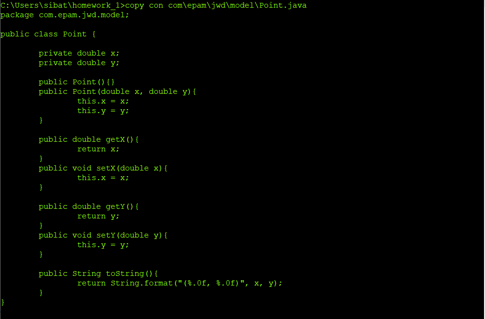
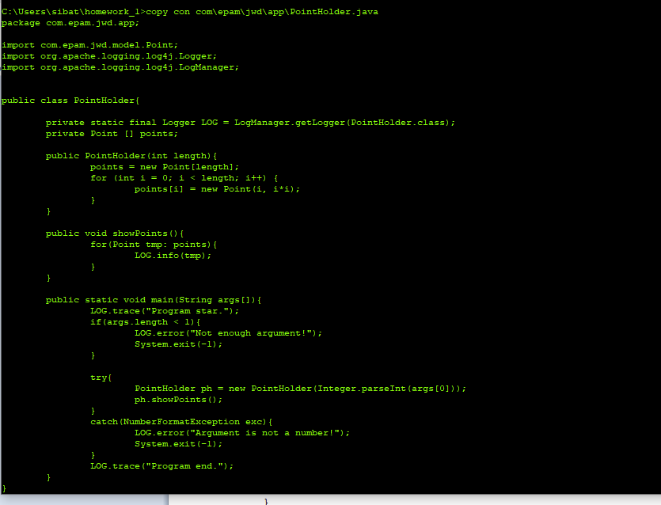
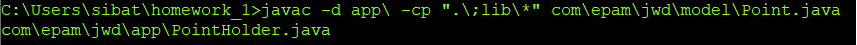
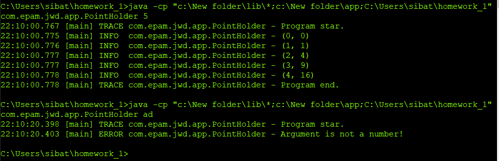
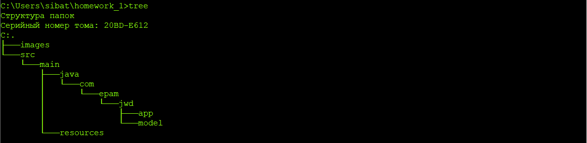
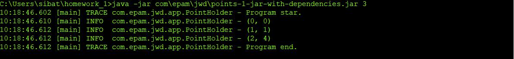

# jwd-homework
1 Создаем два пакета com.epam.jwd.app и com.epam.jwd.model.

    1.1 В пакете model создаем класс Point.

1.2 В пакете app создаем класс PointHolder.

2 Размещаем log-библиотеки в папке lib. 
3-4 Компилируем приложение против библиотек из папки lib в папку app используя флаг -d.

5 Переносим парки app и lib в каталог New folder.

Запускаем приложение.

Меняем структуру проекта и добавляем pom.xml.

Собираем проект.

Можем запустить -jar.

